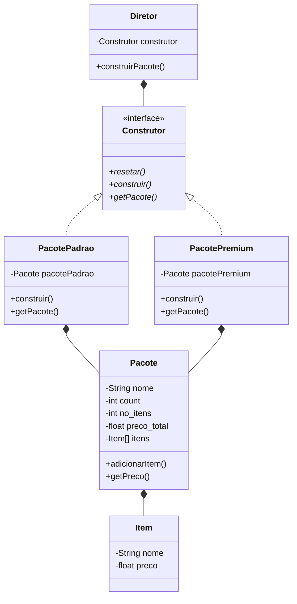

# Builder

Padrão desenvolvido para separar a construção de um objeto, especialmente objetos complexos, de sua representação. Deste modo, diferentes representações podem ser criadas a partir de um mesmo construtor.




## Item

A classe `Item` define um item a ser adicionado em um pacote de produtos, esta classe conta com os atributos privados `nome` e `preco`, assim como seu método construtor e métodos getters e setters.

```java
public class Item {
    private String nome;
    private float preco;
```


## Pacote

A classe `Pacote` define um conjunto de itens e possui os atributos privados `nome`, `count`, `no_itens`, `preco_total` e um array de `Item`, assim como seu método construtor.

```java
public class Pacote {
    private String nome;
    private int count, no_itens;
    private float preco_total;
    private Item[] itens;
```

### Adicionar Item

A classe possui ainda um método público denominado `adicionarItem` que insere um item no pacote na posição correspondente do atributo `itens`.

```java
public void adicionarItem(Item item) {
    if (this.count < this.no_itens) {
        this.itens[this.count] = item;
        this.count++;
    } else {
        System.out.println("Máximo de itens no pacote atingido!");
    }
}
```

### Método getter de `preco_total`

O método getter do atributo `preco_total` é desenvolvido de forma especial para somar os preços de todos os itens no pacote e retornar o resultado da soma.

```java
public float getPreco() {
    for (Item item : itens) {
        this.preco_total += item.getPreco();
    }

    return this.preco_total;
}
```


## Construtor

A classe `Construtor` determina os métodos necessários à construção do objeto, esta é uma interface pública e possui os métodos `construir` e `getPacote`.

```java
public interface Construtor {
    public abstract void construir();
    public abstract Pacote getPacote();
}
```


## Pacote Padrão e Premium

As classes `PacotePadrao` e `PacotePremium` são implementações da interface `Construtor` e possuem um atributo privado do tipo `Pacote`.

```java
public class PacotePadrao implements Construtor {
    private Pacote pacotePadrao;
```

### Construir

O método `construir`, implementado devido à interface `Construtor`, inicializa o atributo do tipo `Pacote` com um nome e quantidade de itens definido, em seguida os itens correspondentes ao pacote são adicionados.

```java
@Override
public void construir() {
	this.pacotePadrao = new Pacote("Padrão", 5);

    this.pacotePadrao.adicionarItem(new Item("Camisa Branca Padrão", 24.5f));
    this.pacotePadrao.adicionarItem(new Item("Camisa Preta Padrão", 24.5f));
	this.pacotePadrao.adicionarItem(new Item("Calça Jeans Padrão", 69.9f));
    this.pacotePadrao.adicionarItem(new Item("Cinto Padrão", 49.9f));
    this.pacotePadrao.adicionarItem(new Item("Sapatênis Padrão", 109.9f));
}
```

### Método getter de `Pacote`

O método `getPacote`, implementado devido à interface `Construtor`, retorna o valor do atributo do tipo `Pacote`.

```java
@Override
public Pacote getPacote() {
    return this.pacotePadrao;
}
```


## Diretor

A classe `Diretor` possui um atributo privado do tipo `Construtor`, assim como seu método construtor, e um método público denominado `construirPacote`, que é responsável por construir e retornar o pacote recebido como parâmetro.

```java
public class Diretor {
    private Construtor construtor;

    public Diretor(Construtor construtor) {
        this.construtor = construtor;
    }

    public Pacote construirPacote() {
        this.construtor.construir();
        
        return this.construtor.getPacote();
    }
}
```
