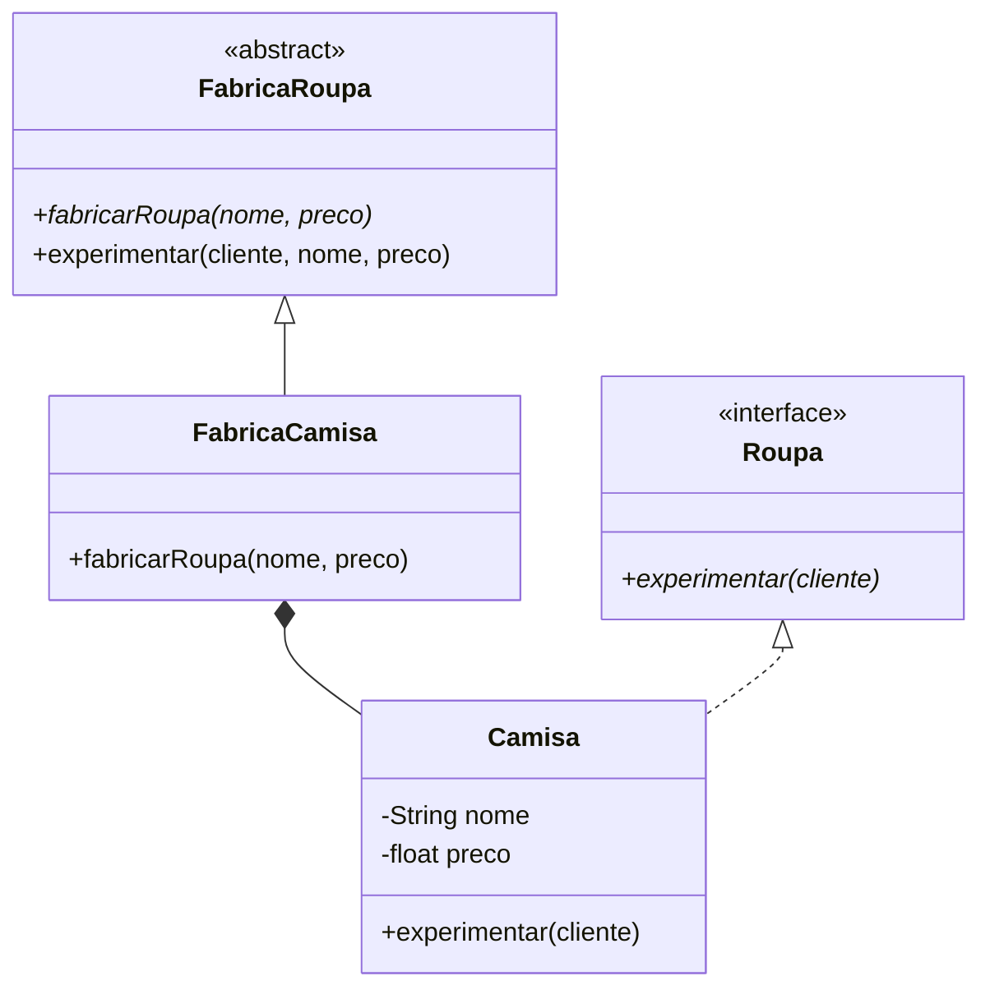

# Factory

Padrão desenvolvido para definir uma interface de criação de um objeto. Deste modo, a instanciação do objeto fica a cargo das subclasses.



## Fábrica Roupa

A classe `FabricaRoupa` se trata de uma classe abstrata com o método abstrato `fabricarRoupa` e o método público `experimentar`.

### Fabricar Roupa

O método abstrato `fabricarRoupa` recebe os parâmetros `nome` e `preco` e retorna um objeto `Roupa` como resultado.

```java
public abstract class FabricaRoupa {
    public abstract Roupa fabricarRoupa(String nome, float preco);
```

### Experimentar

O método `experimentar` recebe os parâmetros `cliente`, `nome` e `preco`, e aplica a implementação deste mesmo método no objeto `Roupa` correspondente.

```java
public void experimentar(String cliente, String nome, float preco) {
    Roupa roupa = this.fabricarRoupa(nome, preco);
    roupa.experimentar(cliente);
}
```


## Fábrica Camisa

A classe `FabricaCamisa` estende a classe `FabricaRoupa` e implementa o método `fabricarRoupa` retornando um objeto do tipo `Camisa` com os parâmetros passados.

```java
public class FabricaCamisa extends FabricaRoupa {
    @Override
    public Camisa fabricarRoupa(String nome, float preco) {
        return new Camisa(nome, preco);
    }
}
```


## Roupa

A interface `Roupa` possui o método abstrato `experimentar` que recebe o parâmetro `cliente`.

```java
public interface Roupa {
    public abstract void experimentar(String cliente);
}
```


## Camisa

A classe `Camisa` implementa a interface `Roupa`, possui os atributos privados `nome` e `preco`, assim como seu construtor e métodos getters e setters correspondentes.

```java
public class Camisa implements Roupa {
    private String nome;
    private float preco;
```

### Experimentar

A classe implementa ainda o método `experimentar`, imprimindo no console as informações correspondentes à instância que chama o método.

```java
 @Override
public void experimentar(String cliente) {
    System.out.println("Cliente: " + cliente + ", vestiu a camisa " + this.nome +
                       ", com preço R$" + String.format("%.2f", this.preco));
}
```

