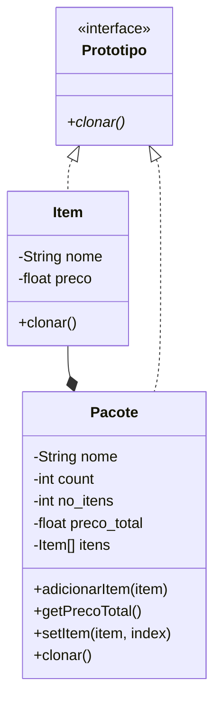

# Prototype

Padrão desenvolvido para permitir a criação de objetos complexos através da cópia de outra instância do mesmo objeto. Deste modo, o novo objeto criado pode alterar apenas as partes necessárias.




## Protótipo

A classe `Prototipo` é uma interface que contém o método público clonar, tal método não possui parâmetros e retorna uma classe que implemente a própria interface.

```java
public interface Prototipo {
    public abstract Prototipo clonar();
}
```


## Item

A classe `Item` implementa a interface `Prototipo` e possui os atributos privados `nome` e `preco`, assim como seu método construtor e métodos getters e setters.

```java
public class Item implements Prototipo {
    private String nome;
    private float preco;
```

### Clonar

O método `clonar` é implementado retornando um novo item com o mesmo nome e preço da instância clonada.

```java
public Item clonar() {
	return new Item(this.nome, this.preco);
}
```


## Pacote

A classe `Pacote` implementa a interface `Prototipo` e possui os atributos privados `nome`, `count`, `no_itens`, `preco_total` e `itens`, assim como seu método construtor.

```java
public class Pacote implements Prototipo {
    private String nome;
    private int count, no_itens;
    private float preco_total;
    private Item[] itens;

    public Pacote(String nome, int no_itens) {
        this.nome = nome;
        this.count = 0;
        this.no_itens = no_itens;
        this.preco_total = 0f;
        this.itens = new Item[no_itens];
    }
```

### Adicionar Item

A classe possui ainda um método público denominado `adicionarItem` que insere um item no pacote na posição correspondente do atributo `itens`.

```java
public void adicionarItem(Item item) {
    if (this.count < this.no_itens) {
        this.itens[this.count] = item;
        this.count++;
    } else {
        System.out.println("Número máximo de itens no pacote atingido!");
    }
}
```

### Método getter de `preco_total`

O método getter do atributo `preco_total` é desenvolvido de forma especial para somar os preços de todos os itens no pacote e retornar o resultado da soma.

```java
public float getPrecoTotal() {
    for (int i = 0; i < this.count; i++) {
        this.preco_total += this.itens[i].getPreco();
    }

    return this.preco_total;
}
```

### Método setter de `itens`

O método setter do atributo `itens` é desenvolvido de forma especial para modificar o item de uma posição específica.

```java
public void setItem(Item item, int index) {
    this.itens[index] = item;
}
```

### Clonar

O método `clonar` é implementado criando uma nova instância de `Pacote` com os atributos `nome` e `no_itens` da classe clonada, em seguida é utilizado um laço `for` para clonar cada item do atributo `itens`, por fim a nova instância é retornada.

```java
public Pacote clonar() {
    Pacote novoPacote = new Pacote(this.nome, this.no_itens);

    for (int i = 0; i < this.count; i++) {
        Item item = this.itens[i].clonar();
        novoPacote.adicionarItem(item);
    }

    return novoPacote;
}
```

