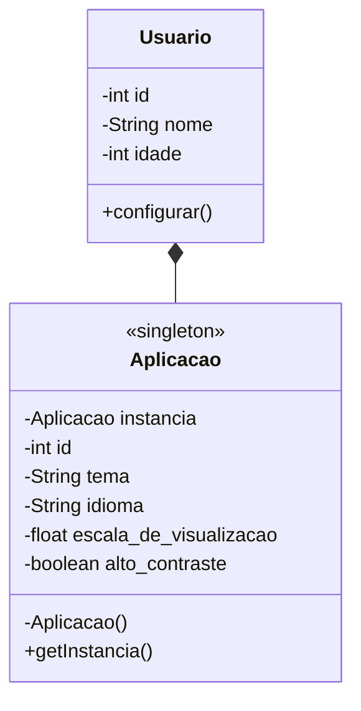

# Singleton

Padrão desenvolvido para garantir que a classe singleton possua uma, e apenas uma, instância em toda a aplicação. Deste modo, toda instanciação da classe se refere ao mesmo objeto.




## Aplicação _(Classe Singleton)_

A classe desenvolvida de acordo com o padrão singleton é denominada `Aplicacao`, esta é de carater final e possui os atributos privados `id`, `tema`, `idioma`, `escala_de_visualizacao` e `alto_contraste`, que guardam a configuração da classe, assim como seus métodos getters e setters. É encontrado ainda o atributo privado e estático `instancia`, este é inicializado com o valor `null` para receber a instância única da classe posteriormente.

```java
public final class Aplicacao {
    private static Aplicacao instancia = null;
    private int id;
    private String tema, idioma;
    private float escala_de_visualizacao;
    private boolean alto_contraste;
```

### Construtor

Devido à característica especial do padrão singleton o seu método construtor tem de ser privado, no exemplo apresentado, este apenas designa uma configuração inicial para a classe.

```java
private Aplicacao() {
    this.id = 5646;
    this.tema = "light";
    this.idioma = "english";
    this.escala_de_visualizacao = 1.0f;
    this.alto_contraste = false;
}
```

### Método getter de `instancia`

Ainda pela característica especial do padrão, o método getter do atributo `instancia` é desenvolvido de maneira especial, de modo a permitir a instanciação da classe somente quando esta não tiver sido instanciada, assim como evitar que ocorram problemas de conflito com instanciações concorrentes.

```java
public static Aplicacao getInstancia() {
    if (Aplicacao.instancia == null) {
        synchronized(Aplicacao.class) {
            if (Aplicacao.instancia == null) {
                Aplicacao.instancia = new Aplicacao();
            }
        }
    }

    return Aplicacao.instancia;
}
```


## Usuário

Classe desenvolvida com o intuito de ajustar as configurações da classe `Aplicacao`, a classe `Usuario` possui os atributos privados `id`, `nome` e `idade`, assim como seu construtor e métodos getters e setters.

```java
public class Usuario {
    private String nome;
    private int id, idade;
```

### Configurar

A classe possui ainda um método denominado `configurar` que atribui configurações definidas pela instância de `Usuario` à classe `Aplicacao`.

```java
public void configurar(Aplicacao aplicacao, String tema, String idioma, float escala, boolean contraste) {
    aplicacao.setTema(tema);
    aplicacao.setIdioma(idioma);
    aplicacao.setEscala_de_visualizacao(escala);
    aplicacao.setAlto_contraste(contraste);
}
```
